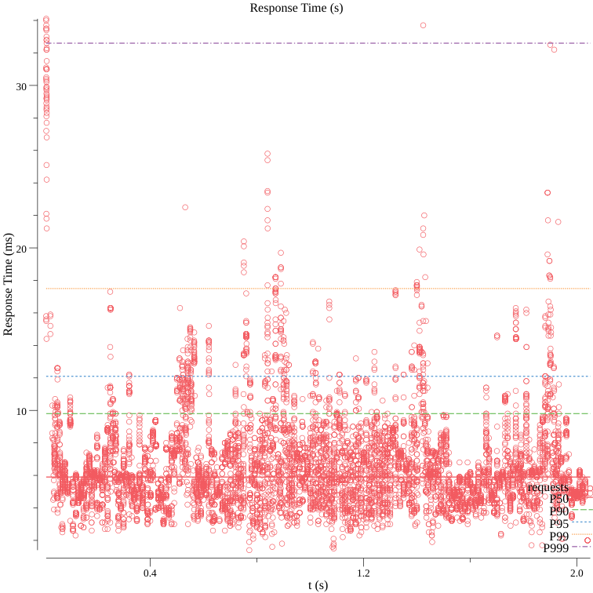

# Hey HDR

The Extension to the excellent https://github.com/rakyll/hey load generator.

## Usage

```shell script
hey -n 1000 -c 30 -o csv http://TARGET_URL | go run hey-hdr.go
```

or

```shell script
hey -n 10000 -c 30 -o csv http://TARGET_URL > example.csv
cat example.csv | go run hey-hdr.go
```

or

```shell script
hey -n 10000 -c 30 -o csv -n 10000 http://TARGET_URL | go run hey-hdr.go -out example
```

## Outputs

- [Output from hey](example.csv)
- [HDR Histogram Data](example.hdr.csv) - load this file in [HDRHistogram Plot](http://hdrhistogram.github.io/HdrHistogram/plotFiles.html)
- [Plot](example.scatter.png)



- hey-hdr cli output:
```text
hey-hdr % cat example.csv | go run hey-hdr.go -out example
  Count: 10000
    Max: 34.101ms
   Mean: 6.659ms
    P50: 5.9ms
    P95: 12.1ms
    P99: 17.5ms
   P999: 32.599ms
  P9999: 34.001ms
 P99999: 34.101ms
```

## Motivation

It's written in Go & is pretty similar to Apache Bench in it's capabilities, in that it was built to replace AB.
Hey is absolutely awesome, performant, and simple. Don't get me wrong, there are plenty of awesome load testing tools 
out there, but I don't think anything can compete with Hey's simplicity.

One of the drawbacks of Hey, is that histogram buckets are simply not granular enough.

```text
Latency distribution:
  10% in 0.0040 secs
  25% in 0.0045 secs
  50% in 0.0055 secs
  75% in 0.0227 secs
  90% in 0.0300 secs
  95% in 0.0315 secs
  99% in 0.3348 secs
```

In the example above, P99 latency means that 1 in every 100 requests will take more than 334.8ms. Given that the average
web page today results in about 100 requests, and there are often chains of requests internally within an API call
to multiple backend services in our service meshes... we can quite confidently translate that to mean with certainty
that 334.8 for an API call just might not be acceptable.

We need to look deeper than just the 99th %ile. Because in here, we can better see where something goes wrong. Otherwise
 what's the point in benchmarking at all?

Fortunately, Hey allows you to send the raw request stats to a CSV file, but this does mean that you need to parse
the output yourself.

`hey-hdr` recalculates the histogram, and we can now look significantly deeper and measure our
latency to 5 nines of accuracy.

```text
  Count: 200
    Max: 58.901ms
   Mean: 16.361ms
    P50: 10.7ms
    P95: 47.101ms
    P99: 56.001ms
   P999: 58.901ms
  P9999: 58.901ms
 P99999: 58.901ms
```

## Next Steps

- [ ] Ability to pass in filename via flag
- [ ] Build out different histograms per http response code
- [ ] Ability to output histograms for more than just the request latency
- [x] Plot latency over time
- [x] Output to [HDRHistogram Plot](http://hdrhistogram.github.io/HdrHistogram/plotFiles.html)
